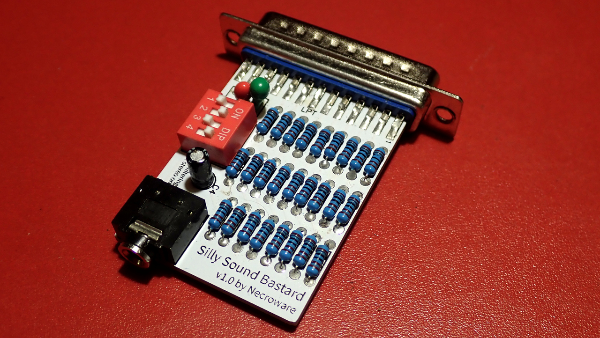
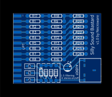
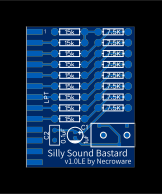

# Silly Sound Bastard

It is yet another clone of the well known Covox Speech Thing. I wanted to get
some practice in EDA and what is one of the simplest part to make, which you
could have fun with? If you are in retro community, you would understand, why it
was a Covox clone.

# What is special about it?

Well, it is still a simple Covox clone. However, I wanted to make something
brute, what you can solder easily, using some through holes parts, but still
with some space for experiments. So I made it with a quad switch, three of which
can be used to control bypass capacitors, to play with low-pass filtering and 
one for switching between mono and (fake-)stereo sound.

# Bill of materials

I have a good news for someone, who is especially keen to solder. Instead of
using two types of resistors with 1/2 relation, I just used all the same types,
but doubbled one row to maintain the relation. This way you don't need to search
for resistors with a proper 1/2 relation, but just can take any resistors, you
have at hand. The parallel port connector is not a through hole part, but rather
a normal connector, like used in any printer cable. It is quite easy to find and
can be directly soldered to the edge of the PCB.

Part   | Count | Remarks
-------|-------| ----------
R1..R26|26x    | 7.5kOhm resistor
C1     |1x     | 0.01uF tantalum capacitor
C2     |1x     | 0.1uF tantalum capacitor
C3     |1x     | 1.0uF tantalum capacitor
C4     |1x     | 1.0uF electrolytic capacitor
SW1    |1x     | Quad-Switch (like LCSC C559139)
AUDIO1 |1x     | 3,5mm Audio jack port (like LCSC C145816)
LPT    |1x     | DB25 parallel port M-plug

# There is a long and a short variants?

Yes, I actually made two variants. The long board has switches, variable low 
pass filtering and uses three rows of same resistors. If you are not interested 
in all of that, you have a set of two types of resistors with a proper 1/2 
relation and space is more important for you, then take the short variant. You
will need less parts and get a more compact solution.

Part      | Count | Remarks
----------|-------| ----------
R1..R8,R17|9x     | 15kOhm resistor
R9..R16   |8x     | 7.5kOhm resistor
C1        |1x     | 0.1uF electrolytic capacitor
C2        |1x     | 1uF tantalum or electrolytic capacitor
AUDIO1    |1x     | 3,5mm Audio jack port (like LCSC C18166)
LPT       |1x     | DB25 parallel port M-plug

# How did I make it?

I used [EasyEDA](https://easyeda.com/) to create this PCBs. If you want to
derive from this work, you can find all the files in the project subfolders of
the boards. To order the parts I used [LCSC](https://lcsc.com).

# Possible modifications

It is reasonable to play around with another resistors and filter capacitors.
The higher the resistors value, the less noise you will get through the parallel
port. However, this also would mean less power on the audio output and necessity
of an amplifier. If you want to use passive headphones, try to go with lower
resistance. I used 1kOhm (and 2kOhm) resistors and the audio quality was still
quite good. Also the low pass filter capacitors are variable. It depends very
much on the speakers, what's the best, but I found, that it's not worth it to go
over 1uF. Even then, filtering starts to be very aggressive. The higher resitor
values you take, the lower capacitor values you should need.

